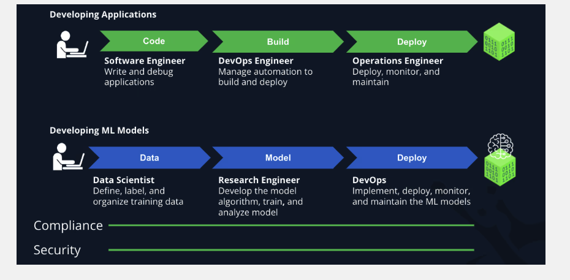
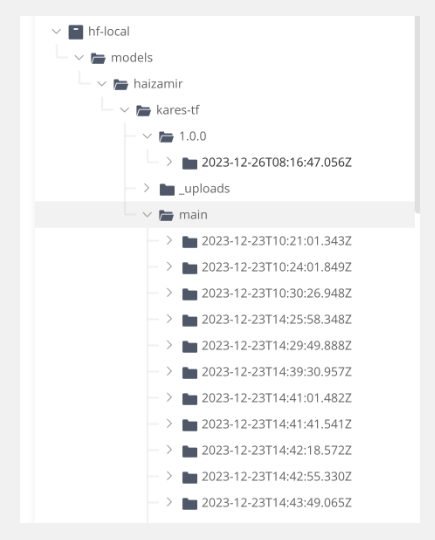

AI/ML models to production — similarities and differences with “traditional” software

# AI/ML Models - Similarities and Differences with “Traditional” Software

| Phase               | Traditional SDLC Security                           | AI/LLM Development Security                                |
|--------------------|------------------------------------------------------|------------------------------------------------------------|
| **1. Requirements**| - Security requirements defined early                | - Define data privacy, bias, explainability                |
|                    | - Threat modeling                                    | - Model misuse/abuse scenarios (e.g., jailbreaks)          |
|                    |                                                      | - Regulatory alignment (e.g., GDPR, NIST RMF)              |
| **2. Design**       | - Secure architecture, least privilege               | - Model card creation, data lineage tracking               |
|                    | - Data flow diagrams (DFDs)                          | - Red teaming AI systems                                   |
|                    |                                                      | - Risk of prompt injection, adversarial attacks            |
| **3. Development**  | - Secure coding practices, code reviews              | - Prompt engineering security, token handling              |
|                    | - Static code analysis                               | - Fine-tuning on secure, vetted data                       |
|                    |                                                      | - Ensure reproducibility of models                         |
| **4. Testing**      | - Penetration testing, fuzzing                       | - LLM-specific red teaming & adversarial testing           |
|                    | - Dynamic analysis                                   | - Bias, toxicity, hallucination testing                    |
| **5. Deployment**   | - Secure configuration, patching                     | - Deployment via secured API endpoints                     |
|                    | - Access control (IAM)                               | - Inference sandboxing, rate limiting                      |
| **6. Monitoring & Ops**| - Logging, SIEM, threat detection               | - Monitor for prompt abuse, data leakage                   |
|                    | - Incident response                                  | - Drift detection in model behavior                        |
|                    |                                                      | - Model governance and continuous evaluation               |

references: 
https://jfrog.com/blog/ml-model-versioning/
